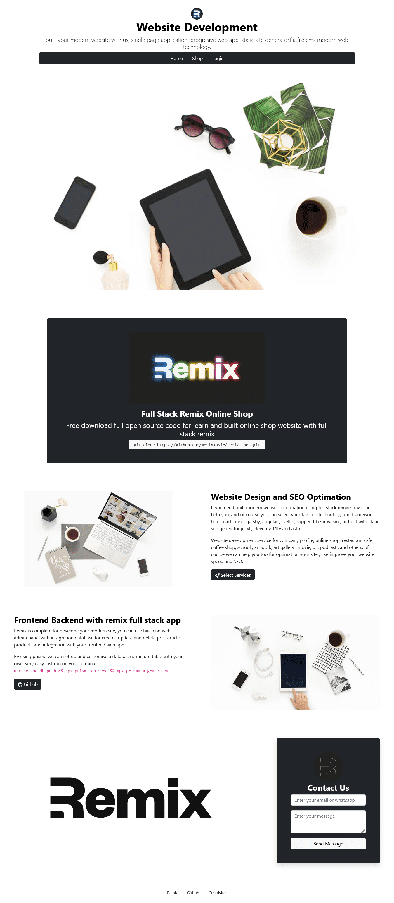
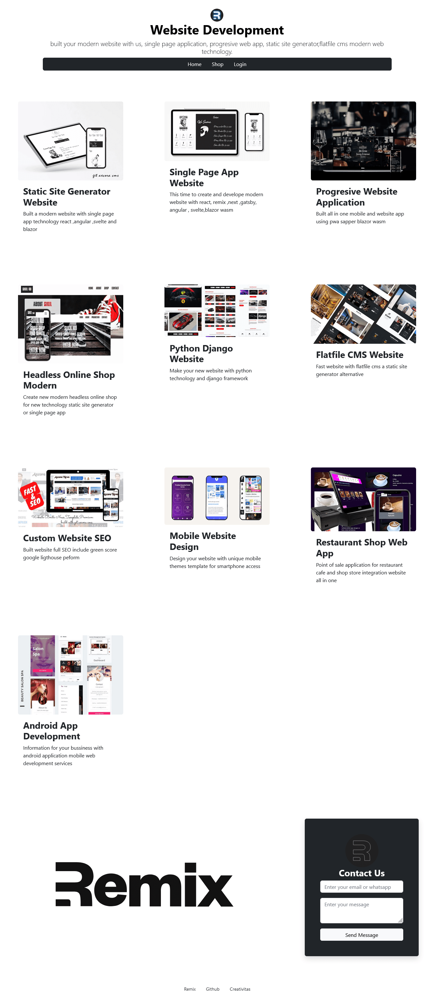
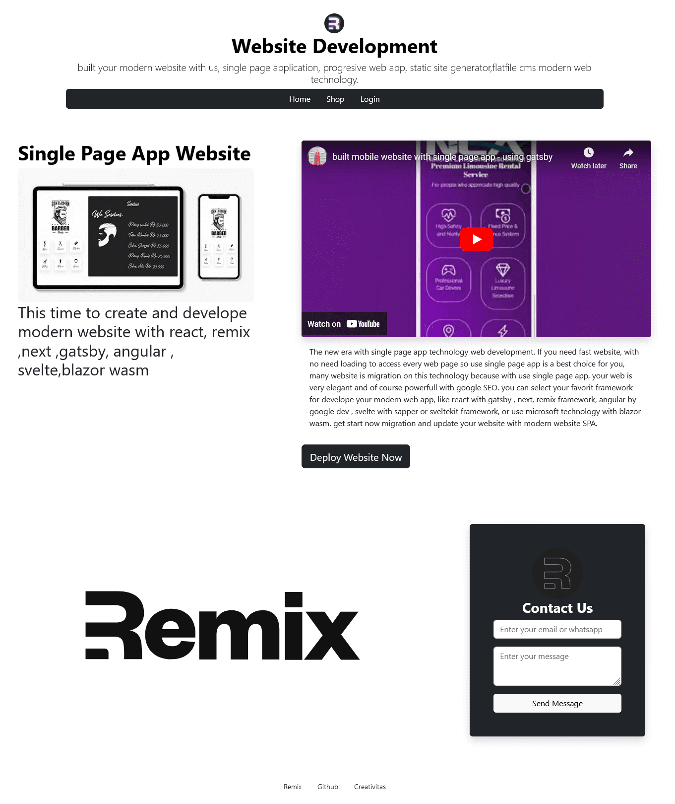
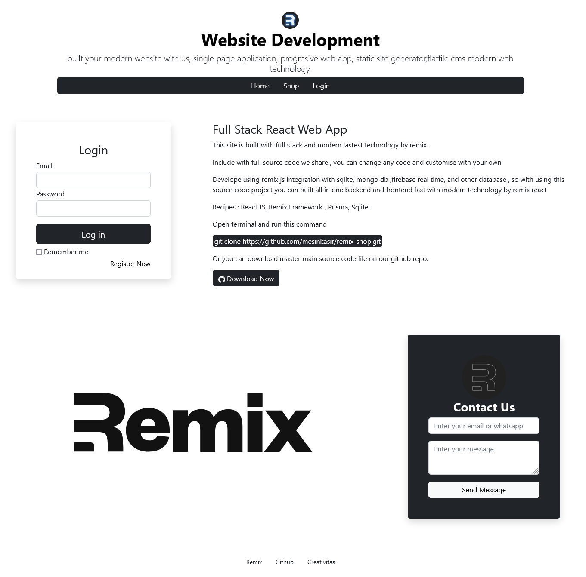
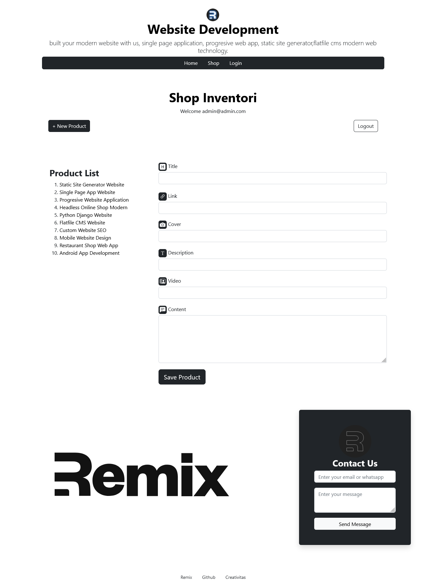

# Remix Fullstack Online Shop Starter

### Test Drive : [Run demo →](https://websitedeveloper.pages.dev/)

Documentation : [https://www.hockeycomputindo.com/2022/12/full-stack-remix-shop-source-code-free.html](https://www.hockeycomputindo.com/2022/12/full-stack-remix-shop-source-code-free.html)

---------------------------

Design 

Home page

Shop Product List Page

Product Details

Login Area

Backend Create Product

---------------------------

### Test Drive : [Run demo →](https://websitedeveloper.pages.dev/)

Documentation : [https://www.hockeycomputindo.com/2022/12/full-stack-remix-shop-source-code-free.html](https://www.hockeycomputindo.com/2022/12/full-stack-remix-shop-source-code-free.html)

####  Install 
- `git clone https://github.com/mesinkasir/remix-shop.git`
- `cd remix-shop`
- rename .env.example to .env
- `npm install`
- `npx prisma db push`
- `npx prisma db seed`
- `npx prisma migrate dev`
- `npm run dev`
- localhost:3000

#### Backend
- user : admin@admin.com
- password : 12345678

Documentation : [https://www.hockeycomputindo.com/2022/12/full-stack-remix-shop-source-code-free.html](https://www.hockeycomputindo.com/2022/12/full-stack-remix-shop-source-code-free.html)
